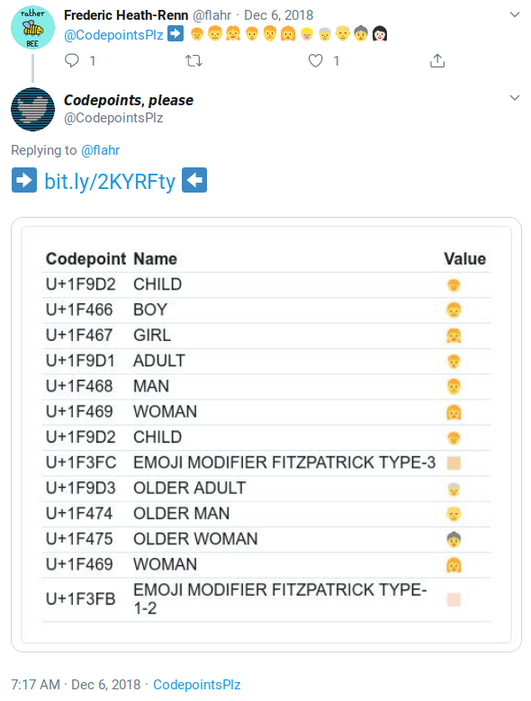

# CodepointsPlz

Azure-based Twitter bot (and associated web backend) that replies to users with Unicode codepoint info.

Bot handles 3 different codepoint dumps:
 1. Dumps codepoints used in the body of a quoted or replied-to tweet (i.e. show info about this person's tweet)
 2. Dumps codepoints used in the body of the @-mentioning tweet (i.e. show info about my tweet)
 3. Dumps codepoints used in a Twitter user's profile.

<blockquote class="twitter-tweet">
Mention me and use an arrow to get Unicode codepoints!  Use ⬆️ in a reply to target the original tweet Use ⬇️ when you quote a tweet to target that tweet Use ➡️ in any tweet to target the string that follows, or point to a Twitter handle to target that user&#39;s profile
&mdash; 𝘾𝙤𝙙𝙚𝙥𝙤𝙞𝙣𝙩𝙨, 𝙥𝙡𝙚𝙖𝙨𝙚 (@CodepointsPlz) <a href="https://twitter.com/CodepointsPlz/status/1004849010014760960?ref_src=twsrc%5Etfw">June 7, 2018</a></blockquote>

Operated for some time as [@CodepointsPlz](https://twitter.com/CodepointsPlz) on Twitter, but is no longer active. The web backend is still live, though, so links generated when the bot was running are still valid.

### Example

 - https://twitter.com/CodepointsPlz/status/1070698789273509889
 - https://bit.ly/2KYRFty
